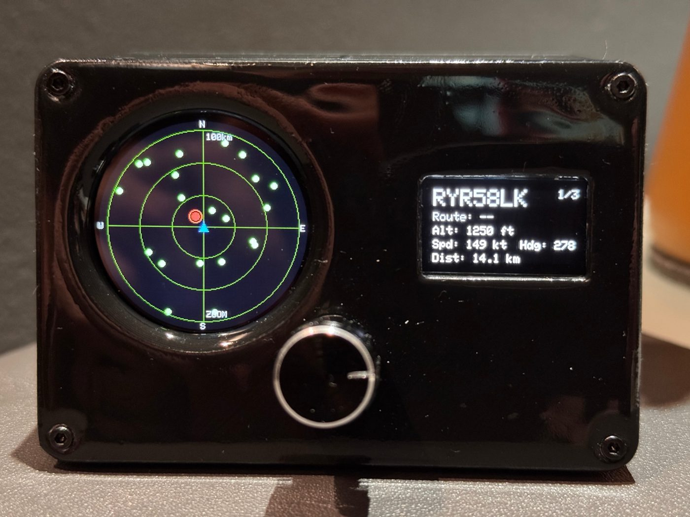
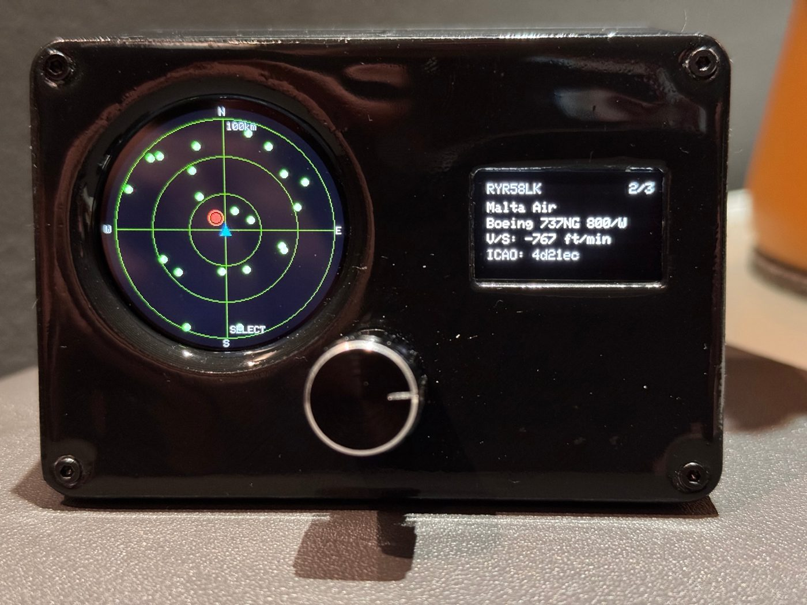
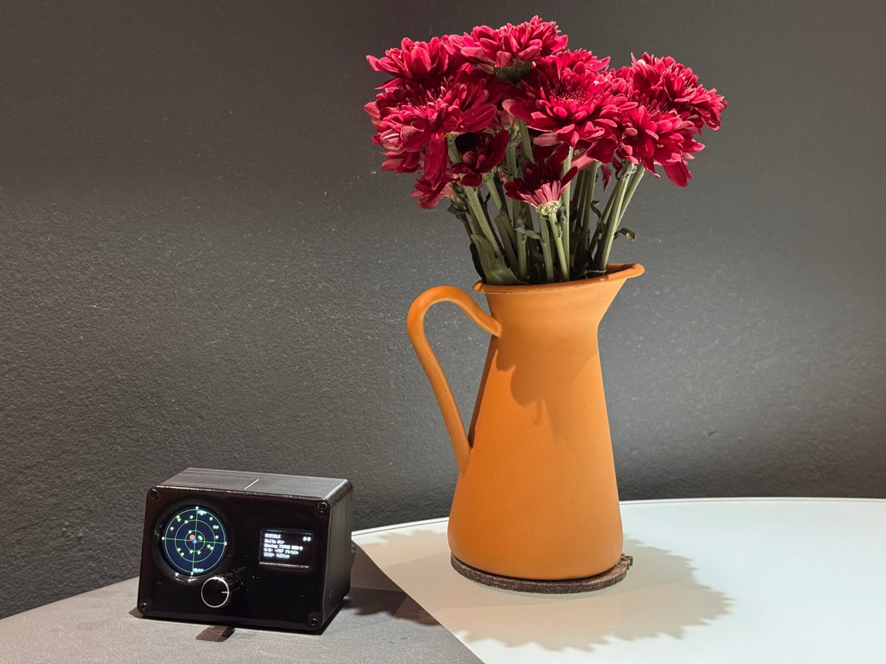
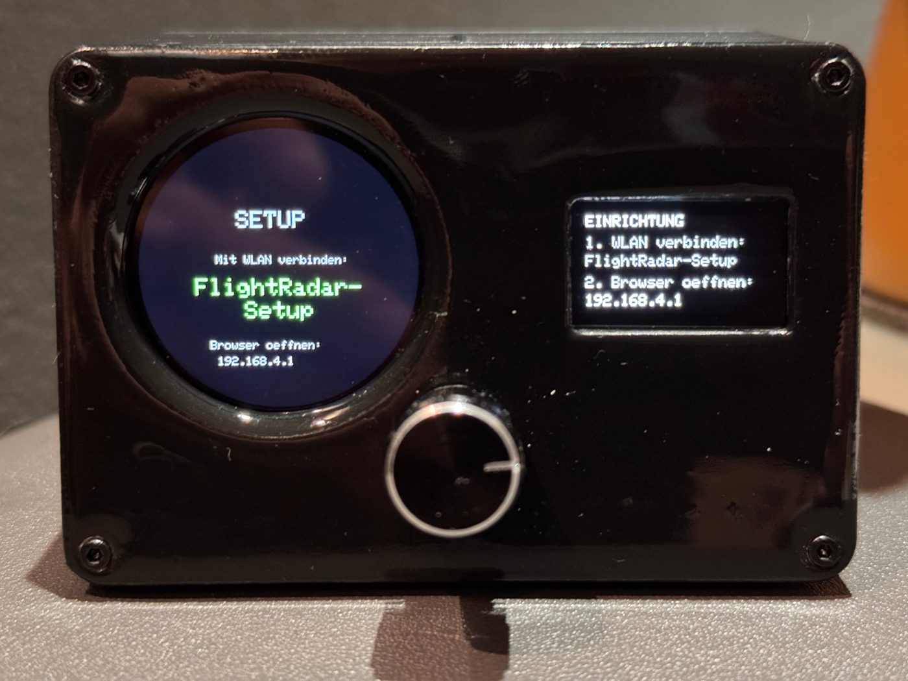

# Flight Radar

ESP32 desk flight radar. A round GC9A01 display shows aircraft around a fixed location, a small SSD1306 OLED shows details of the selected aircraft, and a rotary encoder controls zoom, selection and OLED pages.

Aircraft positions come from the OpenSky Network API, aircraft types from hexdb.io.

## Hardware

- ESP32 DevKit (38 pin)
- GC9A01 1.28" round display, 240x240 (SPI)
- SSD1306 0.96" OLED, 128x64 (I2C, address 0x3C)
- EC11 rotary encoder with push button
- Regulated 5 V supply, at least 1 A
- Adhesive anti-slip pads, 10 mm diameter (underside)

## Wiring

All parts run at 3.3 V. Power is fed directly to the ESP32 `5V` and `GND` pins; the enclosure has a snug cable pass-through. Disconnect the supply while flashing over USB.

| Part | Part pin | ESP32 pin |
|---|---|---|
| GC9A01 | VCC / GND | 3V3 / GND |
| | SCL (SCK) | GPIO18 |
| | SDA (MOSI) | GPIO23 |
| | CS | GPIO15 |
| | DC | GPIO2 |
| | RES | GPIO4 |
| | BLK | 3V3 |
| SSD1306 | VCC / GND | 3V3 / GND |
| | SDA | GPIO21 |
| | SCL | GPIO22 |
| EC11 | + / GND | 3V3 / GND |
| | CLK | GPIO25 |
| | DT | GPIO26 |
| | SW | GPIO27 |
| Power supply | +5 V / GND | 5V / GND |

GPIO2 and GPIO15 are strapping pins. If an upload fails, disconnect both wires briefly.

## Case

3D-printable enclosure: [`case/Flightradar_case.stl`](case/Flightradar_case.stl). The underside has room for adhesive anti-slip pads, 10 mm diameter.

## Setup

1. Install the ESP32 board package and select **ESP32 Dev Module**.
2. Install the libraries *Adafruit GFX Library*, *Adafruit SSD1306*, *GFX Library for Arduino* (by Moon On Our Nation) and *ArduinoJson*.
3. Upload `flight_radar/flight_radar.ino`. Nothing needs to be edited in the sketch.
4. On first start the device opens the WiFi **FlightRadar-Setup** (no password). Connect with a phone or PC and open `http://192.168.4.1`.
5. Select the WiFi network, enter the password and save. Only the WiFi is required. The device restarts and connects.
6. Open `http://flightradar.local/` (or the IP shown on the small display) and enter latitude, longitude, the OpenSky client ID and secret, and an OTA password. Until coordinates are set, the displays ask for them.

## OpenSky API

Aircraft data comes from the [OpenSky Network](https://opensky-network.org). Credentials are optional but recommended: anonymous access is limited to 400 credits per day, accounts get 4,000.

1. Create a free account at [opensky-network.org](https://opensky-network.org).
2. Open the [Account page](https://opensky-network.org/my-opensky/account) and create a new API client.
3. Copy the `client_id` and `client_secret` and paste them into the setup page.

Latitude and longitude: long-press the location in Google Maps, the coordinates appear at the top.

To change settings later, hold the encoder while powering on, or open `http://flightradar.local/` in the home network. Settings are stored in flash. If the saved WiFi cannot be reached, the setup portal opens and the device restarts after 10 minutes to try again.

## Updates (OTA)

Set an OTA password (at least 6 characters) on the setup page. Without a password, OTA is disabled. The first OTA-capable firmware must be flashed over USB.

- Arduino IDE: select the network port `flightradar` under *Tools > Port*, upload as usual and enter the OTA password.
- Browser: open `http://flightradar.local/update`, log in as `admin` with the OTA password and upload the `.bin` exported with *Sketch > Export Compiled Binary*.

If the sketch does not fit the update partition, select *Tools > Partition Scheme > Minimal SPIFFS (1.9MB APP with OTA)* and flash once over USB.

## Binaries

GitHub Actions compiles the sketch on every push (ESP32 Dev Module, partition scheme *Minimal SPIFFS*). The binaries are attached to the workflow run. Pushing a tag such as `v1.0.0` publishes them as a release:

- `*.merged.bin`: complete image for the first flash over USB (write at offset 0x0 with esptool or a browser flasher)
- `flight_radar.ino.bin`: application only, for OTA updates

## Controls

| Action | Effect |
|---|---|
| Turn (ZOOM) | Range: 10, 25, 50, 100 or 200 km |
| Short press | Next OLED page (1/3, 2/3, 3/3) |
| Turn (SELECT) | Select an aircraft (red) |
| Long press (~1 s) | Switch between ZOOM and SELECT |
| Hold while powering on | Opens the setup portal |

The selection stays on the same aircraft between updates. Data is polled every 30 s and backs off for 3 minutes on HTTP 429.

## Notes

- The setup page and some OLED labels are in German.

## Guides

- [Guide (English)](docs/Flight_Radar_Guide_EN.pdf)
- [Anleitung (Deutsch)](docs/Flugradar_Anleitung_DE.pdf)
